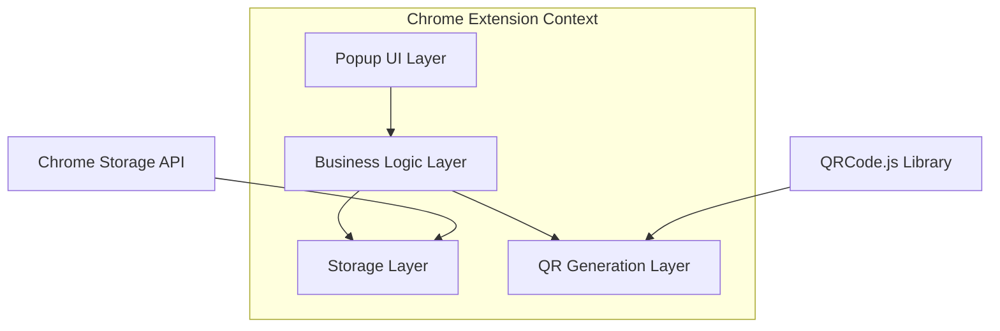

# Design Document: QR Code Generator Chrome Extension

## Overview

The QR Code Generator Chrome Extension is a popup-based browser extension that enables users to generate QR codes from text input and manage a favorites collection. The extension uses Manifest V3 architecture with a popup interface, leveraging Chrome's storage API for data persistence and a JavaScript QR code library for generation.

## Architecture

The extension follows a client-side architecture with three main layers:



### Key Architectural Decisions

1. **Manifest V3 Compliance**: Uses the latest Chrome extension standard for enhanced security and performance
2. **Client-Side Only**: No backend services required, all processing happens in the browser
3. **Popup Interface**: Provides quick access without disrupting the user's browsing experience
4. **Local Storage**: Uses Chrome's storage.local API for reliable data persistence

## Components and Interfaces

### 1. Popup Interface Component

**Responsibilities:**
- Render the main user interface
- Handle user interactions (input, buttons, clicks)
- Display QR codes and favorites list
- Manage UI state and visual feedback

**Key Elements:**
- Text input field for QR code content
- Generate button
- QR code display area
- Favorites list with rename functionality
- Scrollable container for favorites overflow

### 2. QR Generator Component

**Responsibilities:**
- Generate QR codes from text input
- Handle QR code rendering and display
- Validate input constraints and handle errors

**Interface:**
```javascript
class QRGenerator {
  generateQRCode(text: string, container: HTMLElement): Promise<void>
  validateInput(text: string): boolean
  clearDisplay(container: HTMLElement): void
}
```

### 3. Favorites Manager Component

**Responsibilities:**
- Save and retrieve favorites from storage
- Manage favorites CRUD operations
- Handle storage errors and capacity limits

**Interface:**
```javascript
class FavoritesManager {
  saveFavorite(entry: HistoryEntry): Promise<void>
  getFavorites(): Promise<HistoryEntry[]>
  updateFavorite(id: string, entry: HistoryEntry): Promise<void>
  deleteFavorite(id: string): Promise<void>
  renameFavorite(id: string, newName: string): Promise<void>
}
```

### 4. Storage Service Component

**Responsibilities:**
- Abstract Chrome storage API interactions
- Handle storage errors and capacity management
- Provide consistent data serialization

**Interface:**
```javascript
class StorageService {
  save(key: string, data: any): Promise<void>
  load(key: string): Promise<any>
  remove(key: string): Promise<void>
  clear(): Promise<void>
}
```

## Data Models

### HistoryEntry Model

```javascript
interface HistoryEntry {
  id: string;           // Unique identifier (UUID or timestamp-based)
  text: string;         // Original text input
  name: string;         // User-defined name for the entry
  qrCodeDataUrl: string; // Base64 encoded QR code image
  createdAt: Date;      // Creation timestamp
  updatedAt: Date;      // Last modification timestamp
}
```

### Storage Schema

```javascript
interface ExtensionStorage {
  favorites: HistoryEntry[];     // Array of saved favorites
  settings: {                    // Extension settings
    maxFavorites: number;        // Maximum number of favorites (default: 100)
    defaultQRSize: number;       // Default QR code size (default: 256)
  };
}
```

## Correctness Properties

*A property is a characteristic or behavior that should hold true across all valid executions of a system-essentially, a formal statement about what the system should do. Properties serve as the bridge between human-readable specifications and machine-verifiable correctness guarantees.*

### Converting EARS to Properties

Based on the prework analysis, here are the consolidated correctness properties:

**Property 1: QR Code Generation and Display**
*For any* valid text input, generating a QR code should create a visible QR code image and display it in the popup interface
**Validates: Requirements 1.1, 1.3**

**Property 2: Automatic Favorite Creation**
*For any* QR code generation, the system should automatically create a new History_Entry with the input text and assign a default name
**Validates: Requirements 2.1, 2.2**

**Property 3: Favorites Display Completeness**
*For any* set of saved favorites, the popup interface should display all favorites with their names in the favorites list
**Validates: Requirements 2.3**

**Property 4: Favorite Selection and Refill**
*For any* favorite History_Entry, clicking on it should populate the input field with the original text and maintain focus on the input field
**Validates: Requirements 3.1, 3.2**

**Property 5: Favorite Update Preservation**
*For any* existing favorite that is modified and regenerated, the system should update the entry with new content while preserving the user-defined name
**Validates: Requirements 3.3, 3.4**

**Property 6: Rename Operations**
*For any* favorite entry, initiating rename should provide an editable field, confirming changes should update the name, and canceling should preserve the original name
**Validates: Requirements 4.1, 4.2, 4.3**

**Property 7: State Persistence Round Trip**
*For any* set of favorites, closing and reopening the popup should restore all saved History_Entry items with complete data integrity
**Validates: Requirements 5.3, 6.1, 6.2, 6.4**

## Error Handling

### Input Validation Errors
- **Empty Input**: Display user-friendly message when generate button is clicked with empty input
- **Oversized Input**: Handle QR code capacity limits gracefully with informative error messages
- **Invalid Characters**: Process special characters appropriately or provide clear feedback

### Storage Errors
- **Capacity Limits**: Implement graceful degradation when local storage approaches limits
- **Storage Failures**: Provide user feedback for storage operation failures
- **Data Corruption**: Implement data validation and recovery mechanisms

### UI Error States
- **Loading States**: Show appropriate loading indicators during QR generation
- **Network Independence**: Ensure all functionality works offline
- **Browser Compatibility**: Handle differences in Chrome extension API implementations

## Testing Strategy

### Dual Testing Approach

The testing strategy employs both unit tests and property-based tests to ensure comprehensive coverage:

**Unit Tests:**
- Verify specific examples and edge cases
- Test error conditions and boundary values
- Validate integration points between components
- Focus on concrete scenarios like empty input handling, storage capacity limits, and UI state management

**Property-Based Tests:**
- Verify universal properties across all inputs using fast-check library
- Test with randomized data to catch edge cases
- Minimum 100 iterations per property test
- Each test tagged with format: **Feature: qr-code-generator, Property {number}: {property_text}**

### Property-Based Testing Configuration

**Library Selection:** fast-check for JavaScript property-based testing
**Test Configuration:**
- Minimum 100 iterations per property test
- Custom generators for text input, favorites data, and UI states
- Shrinking enabled to find minimal failing examples

**Test Tagging Format:**
Each property-based test must include a comment referencing the design property:
```javascript
// Feature: qr-code-generator, Property 1: QR Code Generation and Display
```

### Testing Framework Integration

**Unit Testing:** Jest for unit tests with Chrome extension mocking
**Property Testing:** fast-check integrated with Jest
**Coverage Requirements:** Minimum 80% code coverage for core functionality
**CI Integration:** All tests must pass before deployment

The combination of unit tests for specific scenarios and property-based tests for universal correctness provides comprehensive validation of the extension's functionality while maintaining development velocity.